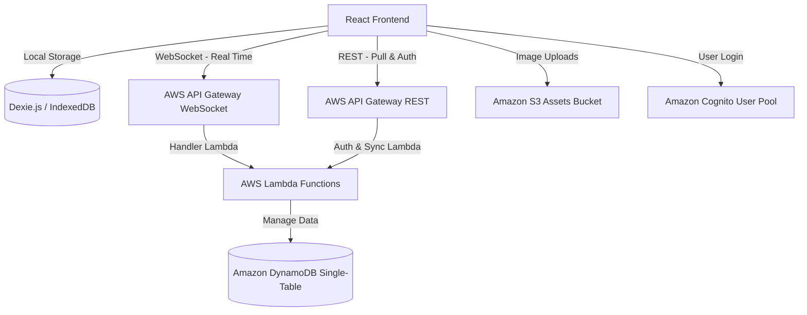

# NoteCognition

NoteCognition is a premium, local-first Markdown editor and note-taking platform. It features real-time synchronization, offline availability, and a unique **"Host-Your-Own-Data"** architecture that allows users to deploy and run their own private backend on their personal AWS account with a single click.

---

## ✨ Features

* 🚀 **Local-First Architecture**: Built using Dexie.js (IndexedDB) to store all note contents and folder configurations directly on your device. The app operates with zero lag and works fully offline.
* ⚡ **Real-Time WebSocket Sync**: Incremental change sync via WebSockets. If you edit a note, it updates character-by-character on all other signed-in devices.
* 🛡️ **Host-Your-Own-Data (1-Click AWS Deploy)**: Don't want your notes on someone else's server? Click the **Cloud Host** button in the app, download the CloudFormation template, and deploy it to your personal AWS account.
* 📝 **Rich Markdown Editor**: Support for split-pane live previews, toolbar shortcuts, inline asset attachments (drag-and-drop/paste images), and exports to `.md` files.
* 💎 **Premium Dark Mode Design**: Sleek, modern interface using tailored HSL color systems, glassmorphism, responsive navigation trees, and micro-animations.

---

## 🏗️ Architecture & Component Layers

NoteCognition is divided into two distinct components: the **Frontend client** and the **Serverless AWS Backend**.



### 1. Frontend Client (Vite + React)
* **IndexedDB Store**: All files and folders are managed locally through [Dexie.js](https://dexie.org/).
* **Sync Manager**: Watches local IndexedDB changes using Dexie hooks and queues them for remote server upload. It handles connection dropouts gracefully, syncing pending changes when the internet returns.
* **Authentication**: Handled via `amazon-cognito-identity-js` directly communicating with AWS Cognito.

### 2. Serverless AWS Backend (CloudFormation Stack)
* **Amazon Cognito User Pool**: Manages secure user sign-ups, logins, and confirmation code email broadcasts.
* **API Gateway (REST & WebSockets)**: Serves the REST sync endpoints (`/sync/pullAll`, `/sync/push`) and hosts the WebSocket endpoint (`$connect`, `$disconnect`, `$default` routes) for real-time broadcasts.
* **AWS Lambda**: Serverless microservices managing auth authentication checks, incremental delta merges, and active connection socket broadcasts.
* **Amazon DynamoDB (Single-Table Design)**: Stored in a single high-performance table (`notecognition-data-dev`) optimized using Partition Keys (`PK`) and Sort Keys (`SK`):
  * **Folders & Notes**: Partitioned by parent ID and indexed by user ID.
  * **WebSocket Connections**: Tracks active connection IDs to broadcast edits to active sessions.
* **Amazon S3**: Hosts note attachment uploads (images/assets) with public-read permissions restricted to the upload folder prefix.

---

## 🚀 Getting Started

### 1. Run the Frontend Locally
Make sure you have [Node.js](https://nodejs.org/) installed.

1. Clone or download the repository.
2. Install dependencies:
   ```bash
   npm install
   ```
3. Start the Vite development server:
   ```bash
   npm run dev
   ```
4. Open [http://localhost:5173](http://localhost:5173) in your browser.

---

## 🛠️ Infrastructure Deployment (Developers)

If you are a developer and want to deploy the default backend stack in your AWS account, we have included PowerShell scripts to automate the packaging and deployment.

### Deploy the Backend Stack
1. Open PowerShell in the root directory.
2. Run the deployment script:
   ```powershell
   .\deploy.ps1
   ```
3. Enter your **AWS Access Key ID**, **AWS Secret Access Key**, and preferred **AWS Region** (e.g. `ap-south-1`) when prompted.
4. The script will package the Lambdas, create your bootstrap S3 bucket, deploy the CloudFormation template, and automatically generate your local `.env` configuration file.

### Destroy the Backend Stack
To wipe out the CloudFormation stack:
```powershell
.\destroy.ps1
```

---

## 🛡️ How to Host Your Own Data (Users)

If you are accessing the hosted website and want your data completely private:

1. Click **Cloud Host** in the top navigation toolbar.
2. Click **Download CloudFormation Template** to save the stack file (`notecognition-template.yaml`) to your computer.
3. Click **Open AWS CloudFormation Console** to open your personal AWS Console.
4. Select **Create Stack** ➡️ **With new resources (standard)**.
5. Choose **Upload a template file** and select the downloaded file. Click Next.
6. Once the stack finishes deploying, click the **Outputs** tab in your CloudFormation Console.
7. Copy the values (`ApiUrl`, `WebSocketUrl`, `UserPoolId`, `UserPoolClientId`, and `Region`) and paste them into the NoteCognition settings modal.
8. Click **Save & Connect**. The app will immediately point to your private serverless database!
