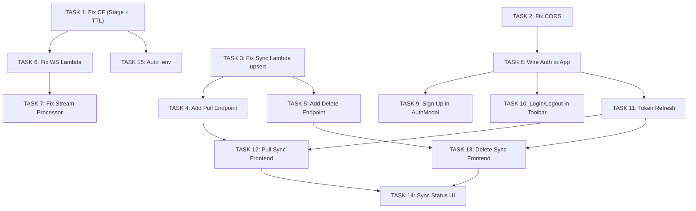

# Cloud Sync — Current State Analysis & Development Tasks

## Current State Audit

### What Exists (Code Written)

| Layer | Component | File | Built? |
|-------|-----------|------|--------|
| **Frontend** | AuthService | [AuthService.ts](file:///d:/MINDMARK/NoteCognition/src/app/services/AuthService.ts) | ✅ Sign-up, confirm, sign-in, session, sign-out |
| **Frontend** | AuthModal | [AuthModal.tsx](file:///d:/MINDMARK/NoteCognition/src/app/components/AuthModal.tsx) | ⚠️ Sign-in only, no sign-up/confirm UI |
| **Frontend** | SyncService | [SyncService.ts](file:///d:/MINDMARK/NoteCognition/src/app/services/SyncService.ts) | ⚠️ Push-only, no pull, no token refresh |
| **Backend** | Sync Lambda | [sync/index.mjs](file:///d:/MINDMARK/NoteCognition/backend/sync/index.mjs) | ⚠️ 3 routes only, no pull/delete, no CORS preflight |
| **Backend** | WebSocket Lambda | [websocket/index.mjs](file:///d:/MINDMARK/NoteCognition/backend/websocket/index.mjs) | ⚠️ No auth verification, userId from query string |
| **Backend** | Stream Processor | [stream-processor/index.mjs](file:///d:/MINDMARK/NoteCognition/backend/stream-processor/index.mjs) | ⚠️ No stale connection cleanup, no DELETE handling |
| **Infra** | CloudFormation | [template.yaml](file:///d:/MINDMARK/NoteCognition/cloudformation/template.yaml) | ⚠️ Missing WebSocket Stage, GSI1 unused, no TTL config |
| **Infra** | Deploy Script | [deploy.ps1](file:///d:/MINDMARK/NoteCognition/deploy.ps1) | ⚠️ No auto .env generation |

### What's NOT Connected

The grep confirms: **App.tsx has zero references to AuthService, SyncService, or AuthModal.** Everything sync-related is built but completely disconnected from the running app.

---

## Bugs & Critical Issues Found

### 🔴 BUG 1 — WebSocket API has no Stage (template.yaml)

The `NoteCognitionWebSocketApi` resource creates the API but there's **no `AWS::ApiGatewayV2::Stage`** resource. The WSS URL in the Outputs will resolve to nothing — connections will fail with 403.

**Location**: [template.yaml:158-163](file:///d:/MINDMARK/NoteCognition/cloudformation/template.yaml#L158-L163)

---

### 🔴 BUG 2 — DynamoDB TTL not enabled (template.yaml)

WebSocket connections store a `ttl` field ([websocket/index.mjs:22](file:///d:/MINDMARK/NoteCognition/backend/websocket/index.mjs#L22)) but the DynamoDB table has **no TTL configuration**. Stale connections will never auto-expire.

**Location**: [template.yaml:14-43](file:///d:/MINDMARK/NoteCognition/cloudformation/template.yaml#L14-L43)

---

### 🔴 BUG 3 — Stream Processor doesn't clean up GoneException connections

When a WebSocket connection is stale, the stream processor catches `GoneException` but only logs it — **never deletes the stale connection record** from DynamoDB.

**Location**: [stream-processor/index.mjs:46-48](file:///d:/MINDMARK/NoteCognition/backend/stream-processor/index.mjs#L46-L48)

---

### 🔴 BUG 4 — Sync Lambda has no CORS preflight handler

The `response()` helper has `Access-Control-Allow-Origin: *` but there's **no `OPTIONS` handler**. Browser preflight requests will get a 404 → all `fetch()` calls from the frontend will fail.

**Location**: [sync/index.mjs:49](file:///d:/MINDMARK/NoteCognition/backend/sync/index.mjs#L49)

---

### 🔴 BUG 5 — PUT /file/:id doesn't set `ownerId` or `GSI1` keys

The `UpdateCommand` only sets `content, title, preview, updatedAt`. It doesn't set `ownerId` (needed by stream processor to route WebSocket messages) or `GSI1PK/GSI1SK` (needed for pull sync). If a note is created via `POST /resource` then updated via `PUT /file/:id`, the `ownerId` persists — but if someone ever calls PUT on a non-existent item, the stream processor will skip it (ownerId = undefined).

**Location**: [sync/index.mjs:28-38](file:///d:/MINDMARK/NoteCognition/backend/sync/index.mjs#L28-L38)

---

### 🟡 BUG 6 — SyncService.pushNote() calls PUT but never POST first

The frontend's `pushNote()` calls `PUT /file/{id}` which runs an `UpdateCommand`. But if the item doesn't exist in DynamoDB yet, `UpdateCommand` will create a sparse item missing `PK`, `SK`, `ownerId`, `type`, etc. The first sync should use `POST /resource` to create, then `PUT` to update.

**Location**: [SyncService.ts:90-110](file:///d:/MINDMARK/NoteCognition/src/app/services/SyncService.ts#L90-L110)

---

### 🟡 BUG 7 — JWT token never refreshes

`SyncService` stores `idToken` at configure-time. Cognito tokens expire after **1 hour**. After that, all API calls will get 401 Unauthorized. There's no token refresh logic.

**Location**: [SyncService.ts:15-18](file:///d:/MINDMARK/NoteCognition/src/app/services/SyncService.ts#L15-L18)

---

### 🟡 BUG 8 — WebSocket userId comes from query string (no auth)

The WebSocket Lambda reads `userId` from `event.queryStringParameters?.userId`. Anyone can connect as any user by passing a different userId. There's no JWT verification.

**Location**: [websocket/index.mjs:13](file:///d:/MINDMARK/NoteCognition/backend/websocket/index.mjs#L13)

---

### 🟡 BUG 9 — WebSocket `$disconnect` can't access query params

API Gateway doesn't forward query string parameters on `$disconnect` events. The Lambda tries to read `userId` from query params to delete the connection, but it will get `undefined` → deletes with wrong key → connection record orphaned.

**Location**: [websocket/index.mjs:13](file:///d:/MINDMARK/NoteCognition/backend/websocket/index.mjs#L13)

---

## Missing Features

| Feature | Impact |
|---------|--------|
| **Pull sync** (cloud → local) | New device gets nothing. No way to download notes from the cloud. |
| **Delete sync** | Deleting a note locally doesn't delete it from DynamoDB. |
| **Create-vs-update logic** | Frontend doesn't distinguish first sync from subsequent syncs. |
| **Sync status UI** | User has no idea if sync is working, failing, or offline. |
| **Offline queue** | Changes made offline aren't queued for later sync. |
| **Conflict detection** | Two devices editing → last write silently overwrites. |

---

## Development Tasks

### TASK 1 — Fix CloudFormation: Add WebSocket Stage + TTL

**Files**: [template.yaml](file:///d:/MINDMARK/NoteCognition/cloudformation/template.yaml)

**What to do**:
1. Add a WebSocket Stage resource after the WebSocket API (line ~163):
```yaml
WebSocketStage:
  Type: AWS::ApiGatewayV2::Stage
  Properties:
    ApiId: !Ref NoteCognitionWebSocketApi
    StageName: !Ref Environment
    AutoDeploy: true
```
2. Add TTL configuration to the DynamoDB table (inside `NoteCognitionTable.Properties`):
```yaml
TimeToLiveSpecification:
  AttributeName: ttl
  Enabled: true
```

**Why first**: Without the Stage, WebSocket connections are impossible. Everything downstream (real-time sync) depends on this.

---

### TASK 2 — Fix CORS in Sync Lambda

**Files**: [sync/index.mjs](file:///d:/MINDMARK/NoteCognition/backend/sync/index.mjs)

**What to do**:
1. Add an OPTIONS handler at the top of the try block:
```js
if (httpMethod === "OPTIONS") {
  return {
    statusCode: 200,
    headers: {
      "Access-Control-Allow-Origin": "*",
      "Access-Control-Allow-Methods": "GET,PUT,POST,DELETE,OPTIONS",
      "Access-Control-Allow-Headers": "Content-Type,Authorization",
    },
    body: "",
  };
}
```
2. Add `Access-Control-Allow-Headers` to the `response()` helper:
```js
const response = (statusCode, body) => ({
  statusCode,
  headers: {
    "Content-Type": "application/json",
    "Access-Control-Allow-Origin": "*",
    "Access-Control-Allow-Methods": "GET,PUT,POST,DELETE,OPTIONS",
    "Access-Control-Allow-Headers": "Content-Type,Authorization",
  },
  body: JSON.stringify(body),
});
```

**Why**: Without this, no browser fetch request will succeed — CORS preflight fails.

---

### TASK 3 — Fix Sync Lambda: Upsert with ownerId + GSI1 keys

**Files**: [sync/index.mjs](file:///d:/MINDMARK/NoteCognition/backend/sync/index.mjs)

**What to do**:
1. Change `PUT /file/:id` to use `PutCommand` instead of `UpdateCommand` (full upsert):
```js
if (httpMethod === "PUT" && path.startsWith("/file/")) {
  const fileId = path.split("/")[2];
  const { content, title, preview, parentId } = body;
  const now = new Date().toISOString();
  const item = {
    PK: `PARENT#${parentId || 'ROOT'}`,
    SK: `FILE#${fileId}`,
    id: fileId,
    parentId: parentId || 'ROOT',
    type: 'file',
    content, title, preview,
    ownerId: userId,
    updatedAt: now,
    GSI1PK: `USER#${userId}`,
    GSI1SK: `UPDATED#${now}`,
  };
  await docClient.send(new PutCommand({ TableName: TABLE_NAME, Item: item }));
  return response(200, { message: "File saved" });
}
```
2. Also add GSI1 keys to `POST /resource`:
```js
GSI1PK: `USER#${userId}`,
GSI1SK: `UPDATED#${new Date().toISOString()}`,
```

**Why**: Fixes BUG 5 and BUG 6. Every item now has `ownerId` (for stream routing) and GSI1 keys (for pull sync).

---

### TASK 4 — Add Pull Sync Endpoint (GET /sync/pull)

**Files**: [sync/index.mjs](file:///d:/MINDMARK/NoteCognition/backend/sync/index.mjs)

**What to do**:
Add a new route:
```js
if (httpMethod === "GET" && path === "/sync/pull") {
  const since = event.queryStringParameters?.since;
  const params = {
    TableName: TABLE_NAME,
    IndexName: "GSI1",
    KeyConditionExpression: since
      ? "GSI1PK = :pk AND GSI1SK > :sk"
      : "GSI1PK = :pk",
    ExpressionAttributeValues: {
      ":pk": `USER#${userId}`,
      ...(since ? { ":sk": `UPDATED#${since}` } : {}),
    },
  };
  const result = await docClient.send(new QueryCommand(params));
  return response(200, result.Items);
}
```

**Why**: Currently there's no way to download notes from the cloud. A new device or reconnected client needs this.

---

### TASK 5 — Add Delete Sync Endpoint (DELETE /file/:id)

**Files**: [sync/index.mjs](file:///d:/MINDMARK/NoteCognition/backend/sync/index.mjs)

**What to do**:
```js
if (httpMethod === "DELETE" && path.startsWith("/file/")) {
  const fileId = path.split("/")[2];
  const parentId = event.queryStringParameters?.parentId || 'ROOT';
  await docClient.send(new DeleteCommand({
    TableName: TABLE_NAME,
    Key: { PK: `PARENT#${parentId}`, SK: `FILE#${fileId}` },
  }));
  return response(200, { message: "Deleted" });
}
```

**Why**: Deleting a note locally currently leaves it orphaned in DynamoDB.

---

### TASK 6 — Fix WebSocket Lambda: Store userId in connection record

**Files**: [websocket/index.mjs](file:///d:/MINDMARK/NoteCognition/backend/websocket/index.mjs)

**What to do**:
1. On `$connect`: store `connectionId` as the PK so disconnect can find it without query params:
```js
if (routeKey === "$connect") {
  const userId = event.queryStringParameters?.userId || "demo-user";
  // Store TWO records: one for user→connection lookup, one for connection→user lookup
  await docClient.send(new PutCommand({
    TableName: TABLE_NAME,
    Item: {
      PK: `USER#${userId}`,
      SK: `CONN#${connectionId}`,
      connectionId,
      userId,
      ttl: Math.floor(Date.now() / 1000) + 3600,
    }
  }));
  await docClient.send(new PutCommand({
    TableName: TABLE_NAME,
    Item: {
      PK: `CONN#${connectionId}`,
      SK: `CONN#${connectionId}`,
      connectionId,
      userId,
      ttl: Math.floor(Date.now() / 1000) + 3600,
    }
  }));
  return { statusCode: 200, body: "Connected" };
}
```
2. On `$disconnect`: look up userId from the connection record:
```js
if (routeKey === "$disconnect") {
  // Look up who this connection belongs to
  const lookup = await docClient.send(new GetCommand({
    TableName: TABLE_NAME,
    Key: { PK: `CONN#${connectionId}`, SK: `CONN#${connectionId}` },
  }));
  const userId = lookup.Item?.userId;
  if (userId) {
    // Delete both records
    await docClient.send(new DeleteCommand({
      TableName: TABLE_NAME,
      Key: { PK: `USER#${userId}`, SK: `CONN#${connectionId}` },
    }));
    await docClient.send(new DeleteCommand({
      TableName: TABLE_NAME,
      Key: { PK: `CONN#${connectionId}`, SK: `CONN#${connectionId}` },
    }));
  }
  return { statusCode: 200, body: "Disconnected" };
}
```
3. Add `GetCommand` to imports.

**Why**: Fixes BUG 9 — `$disconnect` can't access query params, so it needs a reverse-lookup record.

---

### TASK 7 — Fix Stream Processor: Delete stale connections on GoneException

**Files**: [stream-processor/index.mjs](file:///d:/MINDMARK/NoteCognition/backend/stream-processor/index.mjs)

**What to do**:
1. Add `DeleteCommand` to imports
2. On `GoneException`, delete both the user→connection and connection→user records:
```js
} catch (e) {
  if (e.name === "GoneException") {
    console.log(`Cleaning up stale connection: ${connectionId}`);
    // Look up full record to get userId
    const lookup = await docClient.send(new QueryCommand({ /* ... */ }));
    // Delete CONN# reverse record
    await docClient.send(new DeleteCommand({
      TableName: TABLE_NAME,
      Key: { PK: `CONN#${connectionId}`, SK: `CONN#${connectionId}` },
    }));
    // Delete USER# forward record
    await docClient.send(new DeleteCommand({
      TableName: TABLE_NAME,
      Key: { PK: `USER#${ownerId}`, SK: `CONN#${connectionId}` },
    }));
  }
}
```
3. Also handle `DELETE` stream events — send `NOTE_DELETED` messages to connected clients.

**Why**: Prevents stale connections from piling up and wasting Lambda invocations.

---

### TASK 8 — Wire Auth into App.tsx

**Files**: [App.tsx](file:///d:/MINDMARK/NoteCognition/src/app/App.tsx)

**What to do**:
1. Import `authService`, `syncService`, `AuthModal`
2. Add state: `isAuthenticated`, `showAuthModal`, `userEmail`
3. On mount: call `authService.getSession()` → if valid, configure syncService + set auth state
4. Add `handleAuthSuccess`:
   ```tsx
   const session = await authService.getSession();
   const idToken = session.getIdToken().getJwtToken();
   const userId = session.getIdToken().payload.sub;
   const email = session.getIdToken().payload.email;
   syncService.configure({
     apiUrl: import.meta.env.VITE_API_URL,
     wsUrl: import.meta.env.VITE_WS_URL || '',
     idToken, userId,
   });
   syncService.syncAll(true);
   syncService.startAutoSync();
   setIsAuthenticated(true);
   setUserEmail(email);
   setShowAuthModal(false);
   ```
5. Render `<AuthModal isOpen={showAuthModal} onSuccess={handleAuthSuccess} />`
6. Pass `isAuthenticated`, `userEmail`, `onSignIn`, `onSignOut` to `<Toolbar>`

---

### TASK 9 — Add Sign-Up + Confirm Flow to AuthModal

**Files**: [AuthModal.tsx](file:///d:/MINDMARK/NoteCognition/src/app/components/AuthModal.tsx)

**What to do**:
1. Add state: `mode: 'signin' | 'signup' | 'confirm'`
2. `signup` mode: email + password → `authService.signUp()` → switch to `confirm`
3. `confirm` mode: 6-digit code input → `authService.confirmSignUp()` → switch to `signin`
4. Add toggle links: "Don't have an account? / Already have an account?"
5. Add a "close" button so users can dismiss the modal and stay in offline mode

---

### TASK 10 — Add Login/Logout to Toolbar

**Files**: [Toolbar.tsx](file:///d:/MINDMARK/NoteCognition/src/app/components/Toolbar.tsx)

**What to do**:
1. Add props: `isAuthenticated`, `userEmail`, `onSignIn`, `onSignOut`
2. In the right section, render:
   - Unauthenticated: `<Cloud /> Sign In` button → calls `onSignIn`
   - Authenticated: truncated email label + `<LogOut />` button → calls `onSignOut`

---

### TASK 11 — Add JWT Token Refresh to SyncService

**Files**: [SyncService.ts](file:///d:/MINDMARK/NoteCognition/src/app/services/SyncService.ts)

**What to do**:
1. Instead of storing a static `idToken`, store a `getToken` function:
```tsx
interface SyncConfig {
  apiUrl: string;
  wsUrl: string;
  getToken: () => Promise<string>; // replaces static idToken
  userId: string;
}
```
2. In App.tsx, pass:
```tsx
getToken: async () => {
  const session = await authService.getSession();
  return session.getIdToken().getJwtToken();
}
```
3. In `pushNote()`, call `await this.config.getToken()` before each request
4. Cognito SDK automatically refreshes the token using the refresh token — `getSession()` handles this

**Why**: Tokens expire after 1 hour. Without this, sync silently breaks after the first hour.

---

### TASK 12 — Implement Pull Sync in SyncService

**Files**: [SyncService.ts](file:///d:/MINDMARK/NoteCognition/src/app/services/SyncService.ts)

**What to do**:
1. Add `lastPullTimestamp` stored in `localStorage`
2. Add `pullAll()`:
```tsx
async pullAll() {
  const token = await this.config.getToken();
  const since = localStorage.getItem('nc_lastPull') || '';
  const url = `${this.config.apiUrl}sync/pull${since ? `?since=${since}` : ''}`;
  const res = await fetch(url, {
    headers: { 'Authorization': token },
  });
  const items = await res.json();
  for (const item of items) {
    if (item.type === 'file') {
      const local = await db.notes.get(item.id);
      if (!local || new Date(item.updatedAt) > new Date(local.updatedAt)) {
        await db.notes.put({
          id: item.id,
          title: item.title,
          content: item.content,
          preview: item.preview,
          updatedAt: new Date(item.updatedAt),
        });
      }
    }
  }
  localStorage.setItem('nc_lastPull', new Date().toISOString());
}
```
3. Call `pullAll()` on initial login (before push) and on WebSocket reconnect
4. In `startAutoSync()`, alternate pull and push every 30s

---

### TASK 13 — Implement Delete Sync (Frontend)

**Files**: [SyncService.ts](file:///d:/MINDMARK/NoteCognition/src/app/services/SyncService.ts), [App.tsx](file:///d:/MINDMARK/NoteCognition/src/app/App.tsx)

**What to do**:
1. Add `deleteNote(noteId, parentId)` to SyncService:
```tsx
async deleteNote(noteId: string, parentId = 'ROOT') {
  if (!this.config) return;
  const token = await this.config.getToken();
  await fetch(`${this.config.apiUrl}file/${noteId}?parentId=${parentId}`, {
    method: 'DELETE',
    headers: { 'Authorization': token },
  });
}
```
2. In App.tsx `handleDeleteNote()`, after `db.notes.delete(id)`, also call `syncService.deleteNote(id)` if authenticated
3. Handle `NOTE_DELETED` WebSocket messages (from stream processor) → delete from local Dexie

---

### TASK 14 — Add Sync Status UI to StatusBar

**Files**: [StatusBar.tsx](file:///d:/MINDMARK/NoteCognition/src/app/components/StatusBar.tsx), [SyncService.ts](file:///d:/MINDMARK/NoteCognition/src/app/services/SyncService.ts), [App.tsx](file:///d:/MINDMARK/NoteCognition/src/app/App.tsx)

**What to do**:
1. Add to SyncService:
```tsx
private statusCallback: ((s: string) => void) | null = null;
onStatusChange(cb: (status: string) => void) { this.statusCallback = cb; }
private setStatus(s: string) { this.statusCallback?.(s); }
```
2. Call `setStatus('syncing')` before push/pull, `setStatus('synced')` after, `setStatus('error')` on failure, `setStatus('offline')` when WebSocket disconnects
3. In App.tsx: `syncService.onStatusChange(setSyncStatus)`
4. In StatusBar: show a colored dot + label:
   - 🟢 Synced | 🟡 Syncing... | 🔴 Error | ⚫ Offline

---

### TASK 15 — Auto-Generate .env After Deploy

**Files**: [deploy.ps1](file:///d:/MINDMARK/NoteCognition/deploy.ps1), [.env.example](file:///d:/MINDMARK/NoteCognition/.env.example)

**What to do**:
1. After successful deploy, add to deploy.ps1:
```powershell
$outputs = aws cloudformation describe-stacks --stack-name notecognition-stack-dev --query "Stacks[0].Outputs" --output json --region $region | ConvertFrom-Json
$apiUrl = ($outputs | Where-Object { $_.OutputKey -eq "ApiUrl" }).OutputValue
$poolId = ($outputs | Where-Object { $_.OutputKey -eq "UserPoolId" }).OutputValue
$clientId = ($outputs | Where-Object { $_.OutputKey -eq "UserPoolClientId" }).OutputValue
$wsUrl = ($outputs | Where-Object { $_.OutputKey -eq "WebSocketUrl" }).OutputValue

$envContent = @"
VITE_API_URL=$apiUrl
VITE_USER_POOL_ID=$poolId
VITE_USER_POOL_CLIENT_ID=$clientId
VITE_WS_URL=$wsUrl
VITE_REGION=$region
"@
$envContent | Out-File -FilePath (Join-Path $PSScriptRoot ".env") -Encoding utf8
Write-Host "`.env` file generated!" -ForegroundColor Green
```
2. Add `VITE_WS_URL` to `.env.example`

---

## Execution Order & Dependencies



**Recommended sequence**:

| Sprint | Tasks | Effort |
|--------|-------|--------|
| **Sprint 1: Infra Fixes** | T1, T2, T15 | ~3 hours |
| **Sprint 2: Backend Fixes** | T3, T4, T5, T6, T7 | ~1 day |
| **Sprint 3: Frontend Auth** | T8, T9, T10, T11 | ~1 day |
| **Sprint 4: Full Sync** | T12, T13, T14 | ~1 day |

**Total: ~3-4 days** to get cloud sync fully working end-to-end.
