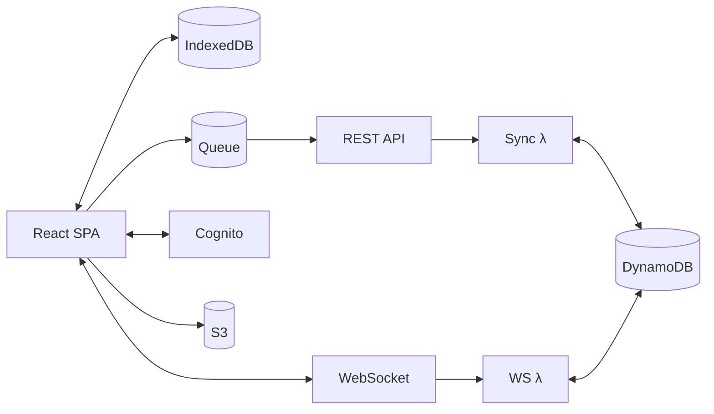
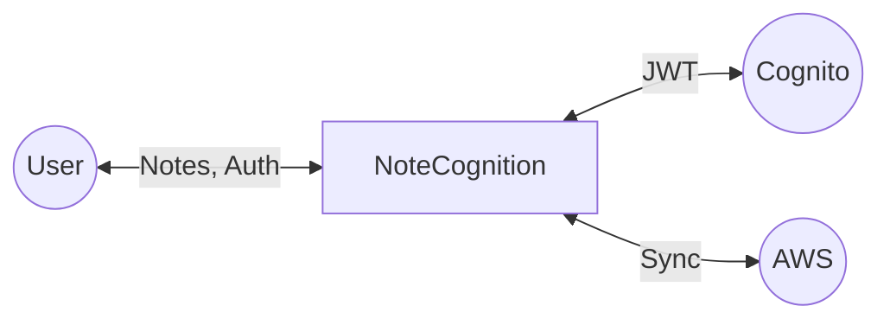
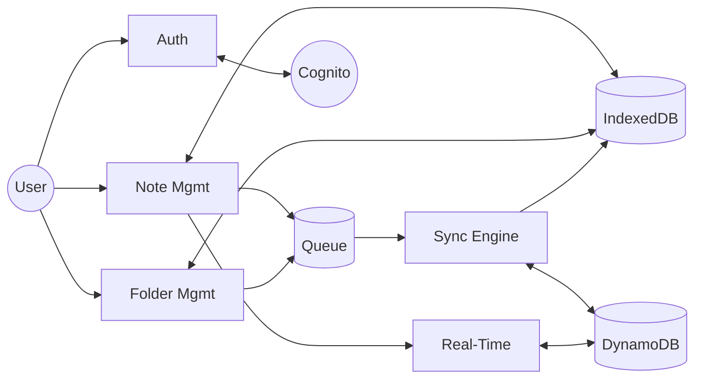
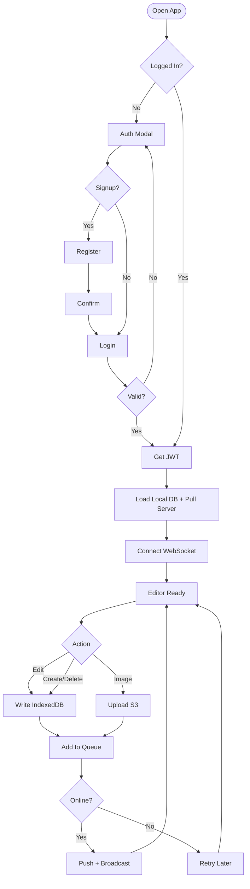
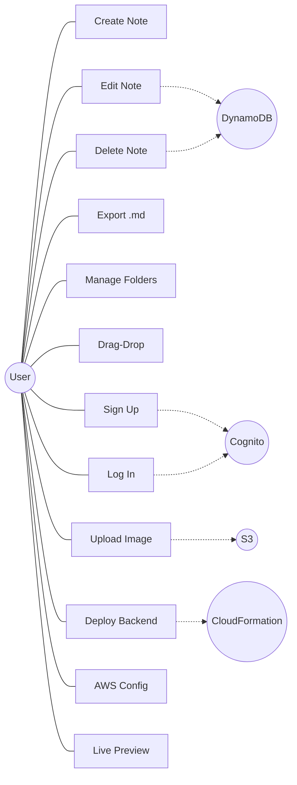
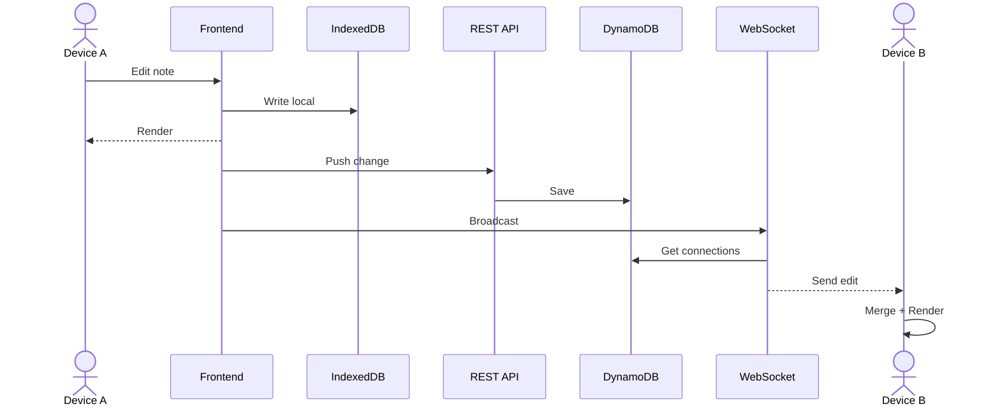
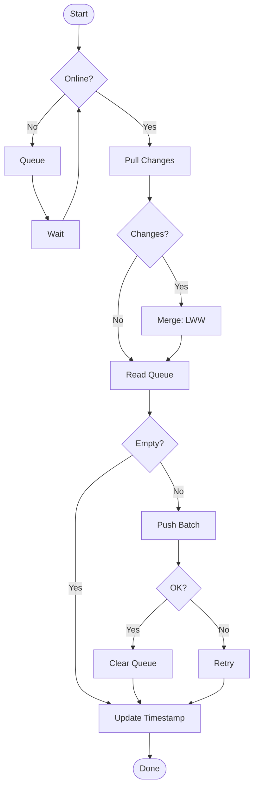
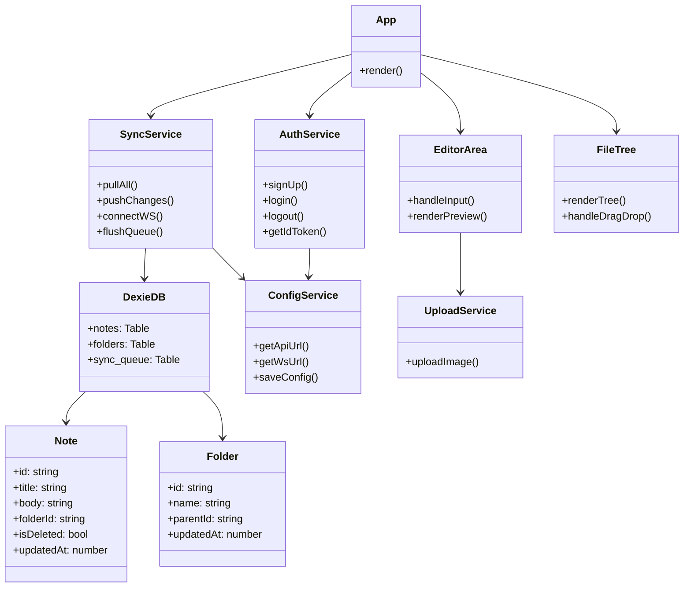
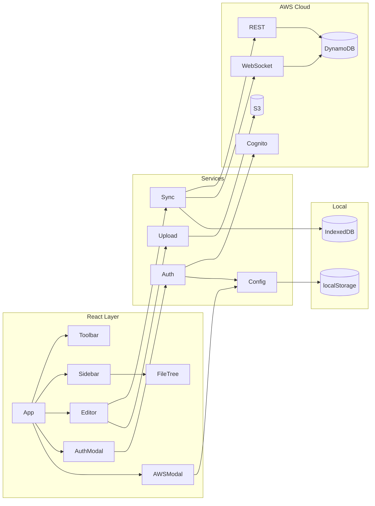
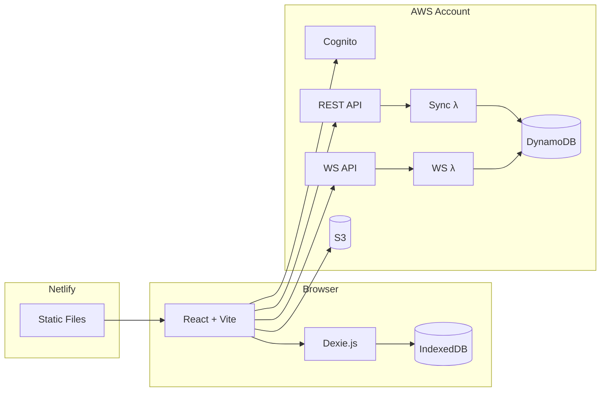

# NoteCognition — Print-Ready Diagrams (Single Page Each)
# Paste into https://mermaid.live → Export PNG at 1x scale

## 1. System Architecture

## 2. Context Diagram (DFD Level 0)

## 3. DFD Level 1

## 4. Flowchart

## 5. Use Case Diagram

## 6. Sequence Diagram

## 7. Activity Diagram — Sync

## 8. Class Diagram

## 9. Component Diagram

## 10. Deployment Diagram

